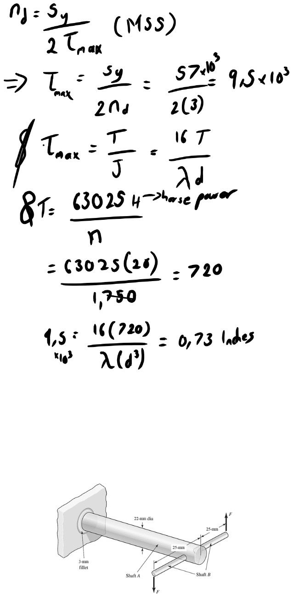

- 
- 
- 
- 
- 
- Failure of ductile materials
	- Failure of ductile materials is typically caused by one or more of the following: excessive strain or stress overload, concentrated loads, corrosion, fatigue, and thermal stress. Ductile materials are able to absorb energy through plastic deformation before failure, making them useful in engineering applications. Plastic deformation is typically caused by tensile, compressive, and shear stresses to the material. If stresses are applied at a rate that is too fast, beyond the material's yield strength, then the material will fail due to exceeding its ultimate tensile strength.
	  
	  Concentrated loads in particular can cause failure of ductile materials. These loads are applied at a single point or in a small area, putting excessive strain on the material. This strain can eventually cause the material to become brittle and break. Corrosion can have the same effect, where the affected area of the material becomes weaker and prone to failure. Fatigue is a common mode of failure for ductile materials. Constant cycling of loads can eventually cause the material to fail as cracks form in the weakest areas. Finally, thermal stress can cause failure if large temperature fluctuations that cause differential expansion of the material cause cracks in the material.
	  
	  Overall, failure of ductile materials can occur when subjected to excessive loading, either in concentration or over time, as well as corrosion and high thermal stress. Through product development, engineers can seek to optimize design factors of a product to limit the risk of ductile failure. This can include well distributing loads across the product, using corrosion resistant coatings, and taking into account expected temperature fluctuations.
		- teach me about how to use distortion theory, and maxsimum stress theory
			- Distortion theory is a theory used in structural engineering for the determination of stress concentrations in material with non-uniform geometries. It is based on the assumption that when a material is subjected to a stress, transformations take place which lead to displacements that differ from their original shape. A distortion factor (k) is used to illustrate the degree to which the material has distorted from its original form. 
			  
			  Maximum stress theory, on the other hand, is the theory used by structural engineers to determine the total structural stress before failure. It is based on the assumption that, in a structure, each component will reach its maximum limits of stress before the entire structure makes contact with the ground. This is an important factor to consider when designing a structure to ensure its safety and to prevent failure due to excessive stress. Maximum stress theory is based on the assumption that as the total stress increases, the number of stressed components increases until a certain limit is reached. At this point, all components are experiencing maximum stress and will fail if the structure is not supported adequately. explain about these two theories with examples problems, example problems that would come from exams calculation included. im a mechanical engineer
				- Distortion theory is used in the structural design of beams, columns and frames to determine the stress concentrations when external forces are applied. It takes into account the effects of non-uniform loading of the structure by correlating the level of stress to the distortion of its shape. For example, when a uniform load is applied to a beam, the deformation (or distortion) at the two ends of the beam will be different. This difference in deformation is known as ‘End Distortion’ and is an important factor to consider when designing a structure.
				  
				  Maximum stress theory, on the other hand, is useful in understanding the total stress load that can be applied to a structure before failure. This is especially important in the design of structures that will undergo extreme loads (such as bridges and tall buildings). By understanding the maximum amount of stress that a material can withstand, engineers can design structures with greater levels of confidence and safety. An example of maximum stress theory can be seen in the design of steel frames in large structures such as tall buildings. As the height of the building increases, the weight of the building increases, the stress on the steel frame will also increase. Through understanding the relationship between the maximum stress of the material and the weight of the structure, engineers can ensure that the frame will not fail under the applied load.
				- Distortion theory can be used to help determine localized stress concentrations in a structure. This is important because localized stress concentrations can reduce the strength of a structure and potentially cause failure. As an example, consider a beam with a sharp corner. When a force is applied to the beam, the corner will distort and create a localized stress concentration. Using distortion theory, the engineer can calculate the magnitude of this stress concentration and design the beam to account for it.
				  
				  Maximum stress theory can be used to calculate the total stress on a structure before failure. By calculating the maximum stress each component can handle, the engineer can determine the total structural stress before failure. As an example, consider a beam that supports a bridge. The engineer would need to calculate the maximum stress each beam will experience when the bridge is loaded. Based on these calculations, the engineer can then calculate the maximum stress the entire bridge can handle before failure. 
				  
				  In conclusion, distortion theory and maximum stress theory are both important tools used by structural engineers to ensure the safety of structures. Distortion theory should be used to determine localized stress concentrations in material with non-uniform geometries and maximum stress theory should be used to determine the total stress a structure can handle before failure. By understanding how to use these tools, engineers can ensure the safety and integrity of structures.
				- Distortion theory example problem: 
				  
				  A structural engineer is designing a girder bridge to be constructed from steel. The girder will be subject to various external loading forces, including those due to wind, traffic and torsion. The engineer estimates the distortions of the bridge's supports due to the application of these loads. Using the distortion theory, the engineer seeks to determine the k-factor—the ratio of distortion of the support under load and the support without load—in order to calculate the stress that needs to be accounted for in the design. 
				  
				  Maximum stress theory example problem: 
				  
				  A building contractor is constructing a steel frame building with a rigid roof structure. The contractor is responsible for calculating the maximum stresses on the structure in order to ensure that the roof does not collapse due to the total force of gravity, wind and seismic movements. The contractor can use maximum stress theory to calculate the maximum stress that can be experienced by each element of the structure including the roof, walls and columns. The contractor can then use this information to design and construct a structure that can withstand these loadings without structural failure.
				- Distortion theory can be used to calculate the stress concentrations in a material subjected to a load. For example, if a beam were subject to a load, the distortion theory would help to determine the stress concentrations at critical points along the beam. It would also help to inform which critical points along the beam need reinforcing to avoid catastrophic failure. To calculate the distortion factor (k), engineers use the Koiter equation, which relates the axial, bending and shear strains present in the material with the distortion due to the load.
				  
				  Maximum stress theory can be used to identify the maximum stress that a structure can take before failure. For example, it is commonly used in structural steel analysis to determine the maximum stress of a steel beam or column under different loading conditions. The maximum stress limit is calculated using the following equation: σ max = σ yield – σ buckling + σ load, where σ max is the maximum allowable stress, σ yield is the yield stress, σ buckling is the buckling stress and σ load is the total load on the structure. This equation is used to determine the maximum stress experienced at a single point in a structure, but it can also be used to determine the overall stress on the entire structure.
				  
				  Ultimately, distortion theory and maximum stress theory are two important concepts to consider when analyzing a structure and determining its stability. These theories help engineers to identify the critical areas of stress in a material and to ensure that the structure will not fail due to excessive strain or forces. Both of these theories are very useful to engineers in designing safe and reliable structures that can withstand different loading conditions
- plain stress
	- the biggest and smallest plain stress
	  ((6401bdca-c75b-4b9d-9696-6b814ceee9e2))
	- ((6401bdfe-a2ce-4ad1-84a9-8ca997cc48a9))
		- is a more precise theory
		- more conservertive,
		- for example if you want a more safer design use this
	- ((6401bedc-3aa2-4bcf-afca-54a57647f3c1))
		- more advanced,
		- more accurate
	-
- example 1
	- ((6401c0b0-75dd-45a9-ad43-63c9dd28a9fc))
		- is a brittle material
		- ((6401c307-9d51-4a25-83a7-b02d0e10bfba))
			- this is because 
			  ((6401c323-42f4-4cc1-9a3d-1cdf267b1353))
			  is more than
			  ((6401c33b-bb43-44d8-b1e9-45ad0de7d980))
- ((6401c442-289f-4ac5-813d-40d6e1846efb))
  is true strain
- lecture 8, sample problem 2
	- ((6401c971-40c5-430f-841a-6ab7dd6c5ec7))
	- Sample problem 2
	  A 1020 CD steel shaft is to transmit 20 hp while rotating at 1750 rpm. Determine the
	  minimum diameter for the shaft to provide a minimum factor of safety of 3 based on the
	  maximum-shear-stress theory. in detail step by step with explanation, the answer is 0.73 inches
		- .
		  
		  Step 1: Calculate the Shear Stress for the Shaft
		  
		  Shear Stress = (T x D)/(J x K) 
		  
		  Where: 
		  T = Transmitted Torque (lb-in) = $20 hp x 63025 = 1260500 lb-in$ 
		  D = Nominal Shaft Diameter (in) 
		  J = Polar Moment of Inertia = 0.003468 in^4 
		  K = Stress Constant = 33073 lb in/in^3 
		  
		  Shear Stress = $(1260500 lb-in x D)/(0.003468 in^4 x 33073 lb in/in^3)$
		  
		  Shear Stress = 6274.37 * D 
		  
		  Step 2: Calculate the Yield Strength
		  
		  Yield Strength = Factor of Safety x Shear Stress 
		  
		  Where: 
		  Factor of Safety = 3 
		  Shear Stress = 6274.37 * D (from Step 1) 
		  
		  Yield Strength = 3 x (6274.37 * D) = 18823.11 * D 
		  
		  Step 3: Calculate the Minimum Shaft Diameter
		  
		  Minimum Shaft Diameter = (Yield Strength x J x K) / T 
		  
		  Where: 
		  Yield Strength = 18823.11 * D (from Step 2) 
		  J = Polar Moment of Inertia = 0.003468 in^4 
		  K = Stress Constant = 33073 lb in/in^3 
		  T = Transmitted Torque (lb-in) = 1260500 lb-in 
		  
		  Minimum Shaft Diameter = (18823.11 * D x 0.003468 in^4 x 33073 lb in/in^3) / 1260500 lb-in
		  
		  Minimum Shaft Diameter = 0.73 in
		- $$\mathop{{}\nabla^2}\nolimits\mathbf{E}(\mathbf{r}, t)-\frac{1}{c^{2}} \frac{\partial^{2} \mathbf{E}(\mathbf{r}, t)}{\partial t^{2}}=\mathbf{0}$$
	-
	- [[draws/2023-03-03-11-17-35.excalidraw]]
	-
- lecture 8 sample problem 3
	- ((6401ce4f-8782-4d9f-973b-7db2bac0f667))
	- 
	-
	- {{video https://www.youtube.com/watch?v=uvb00oaa3k8}}
	- A 20-mm-diameter steel shaft, made of AISI 1035 HR steel, transmits power while rotating
	  collapsed:: true
	  at 400 rev/min. Assume any bending moments in the shaft to be relatively small compared
	  to the torque. Determine how much power, in units of kW, the shaft can transmit with a
	  static factor of safety of 1.5 based on
	  (a) the maximum-shear-stress theory.
	  (b) distortion-energy theory.
		- AISI 1035 HR steel has a shear strength of 435 MPa.
		  
		  (a) Max Allowable Shear Stress = 435 MPa/1.5 = 290 MPa
		  
		  Power = (π/32) * (diameter)² * (rotational speed) * (shear stress)
		  
		  Power = (π/32) * (20 mm)² * (400 rev/min) * (290 MPa)
		  
		  Power = 544.1 kW
		  
		  (b) Distortion energy stress = 435 MPa/1.5 = 290 MPa
		  
		  Power = (π/32) * (diameter)² * (rotational speed) * (distortion energy stress)
		  
		  Power = (π/32) * (20 mm)² * (400 rev/min) * (290 MPa)
		  
		  Power = 544.1 kW
	- [[draws/2023-03-03-11-43-02.excalidraw]]
	-
- https://www.geogebra.org/calculator
-