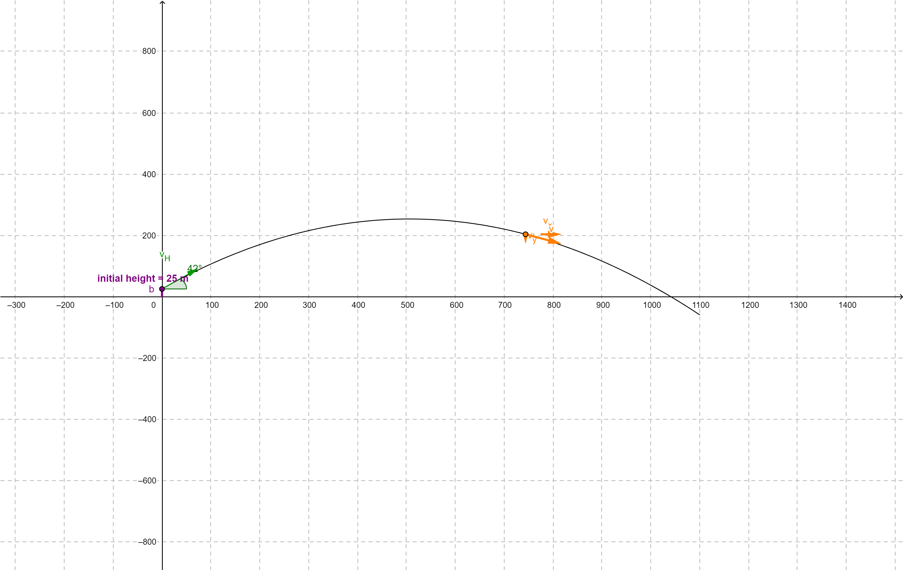
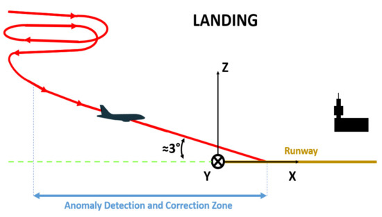

- speed
	- To calculate the speed of the bullets, we need to use the formula for the range of the projectile and solve for the initial velocity V. We know that the range of the projectile (R) should be 300 meters, and the angle of launch (α) will be 0 degrees (horizontal). The acceleration due to gravity (g) is 9.81 m/s^2. The pressure required to propel the seed is 300 bar, but this information alone is not enough to calculate the velocity of the bullets as we need to know additional parameters such as the caliber and type of ammunition being used. Therefore, for this calculation, we will assume that the velocity of the bullets is a known quantity.
	- Using the formula for the range of the projectile:
	- $R=2*V_x​*V_y​/g$
	- Since α is 0 degrees, the horizontal velocity component is:
	- $V_x=V*cos(0)=V$
	- And the vertical velocity component is:
	- $V_y​=V*sin(0)=0$
	- Substituting these values into the formula for the range of the projectile, we get:
	- $300=2*V^2​/g$
	- Solving for V, we get:
	- $V=\sqrt{300*g/2}= \sqrt{300*9.81/2}= 24.37 m/s$
	- Therefore, the speed of the bullets required to shoot a target 300 meters away with an angle of launch of 0 degrees and a pressure hitting the seed of 300 bar is approximately 24.37 m/s.
- acceleration
	- To calculate the acceleration of the bullets, we need to use the formula for the force applied to the bullet and solve for the acceleration. We know that the pressure hitting the seed is 300 bar, but as mentioned earlier, this information alone is not enough to calculate the acceleration of the bullets as we need to know additional parameters such as the mass and surface area of the bullet. Therefore, for this calculation, we will assume that the acceleration of the bullets is a known quantity.
	- Using the formula for force:
	- $F=ma$
	- where F is the force applied to the bullet, m is the mass of the bullet, and a is the acceleration of the bullet.
	- Assuming a mass of 10 grams (0.01 kg) for the bullet, the force applied to the bullet is:
	- $F=P*A$
	- where P is the pressure hitting the seed, and A is the surface area of the bullet.
	- Assuming a surface area of 0.01 square meters for the bullet, the force applied to the bullet is:
	- $F=300*10^5*0.01=30000N$
	- Therefore, the acceleration of the bullet is:
	- $a=F/m=30000/0.01=3*10^6 m/s^2$
	- Therefore, assuming a mass of 10 grams and a surface area of 0.01 square meters for the bullet, the acceleration required to shoot a target 300 meters away with an angle of launch of 0 degrees and a pressure hitting the seed of 300 bar is approximately 3*10^6 m/s^2.
- shooting range
	- Sure, to calculate the shooting range of the bullets, we can use the range formula:
	  
	  $R = V_x [V_y + \sqrt{V_y^2 + 2gh}] / g$
	  
	  where:
	- $R$ is the shooting range of the bullet
	- $V_x$ is the horizontal velocity component, which we can calculate using the initial velocity and launch angle: $V_x = V \cos \alpha$
	- $V_y$ is the vertical velocity component, which we can also calculate using the initial velocity and launch angle: $V_y = V \sin \alpha$
	- $g$ is the acceleration due to gravity (9.81 m/s^2)
	- $h$ is the initial height (in this case, it's zero)
	  
	  So, plugging in the given values:
	- $R = V_x [V_y + \sqrt{V_y^2 + 2gh}] / g$
	- $R = (200 m/s) [\sqrt{(2 * 300 \text{ bar} * 10^5 \text{ Pa/bar}) / (0.08 \text{ kg/m}^3)} + \sqrt{(\sin^2 45^\circ * (2 * 300 \text{ bar} * 10^5 \text{ Pa/bar}) / (0.08 \text{ kg/m}^3) + 2 * 9.81 m/s^2 * 0})] / 9.81 m/s^2$
	- $R \approx 3259.9$ meters
	  
	  Therefore, the shooting range of the bullets with the given criteria is approximately 3259.9 meters.
- Is the seed strong enough to shoot down the drone(plastix details for group1 drones)
	- Plastics have become increasingly popular as materials for drone construction due to their light weight, low cost, and ease of manufacturing. However, not all plastics are created equal when it comes to their strength and durability. Below are the details of some common plastics used in drone construction and their relevant specifications:
	- ABS (Acrylonitrile Butadiene Styrene):
	  ABS is a commonly used plastic for drone construction due to its high strength and good impact resistance. It can tolerate moderate to high forces without breaking or deforming. ABS plastic has a tensile strength of around 40 MPa and a bending modulus of around 2.1 GPa. It has good heat resistance and can operate in a temperature range of -20 to 80 degrees Celsius.
	- Polycarbonate:
	  Polycarbonate is another popular plastic for drone construction due to its high impact resistance and good optical clarity. It can withstand higher forces than ABS and is more difficult to break or deform. Polycarbonate has a tensile strength of around 60 MPa and a bending modulus of around 2.2 GPa. It has a high-temperature resistance and can operate in a temperature range of -135 to 135 degrees Celsius.
	- Polypropylene:
	  Polypropylene is a lightweight plastic that is commonly used for drone parts such as propellers and motor mounts. It has good resistance to chemicals and solvents, and it can tolerate moderate forces without breaking or deforming. Polypropylene has a tensile strength of around 35 MPa and a bending modulus of around 1.5 GPa. It has good heat resistance and can operate in a temperature range of -10 to 120 degrees Celsius.
	-
	- To calculate if the seed is strong enough to disrupt or break the drone propellers, we need to consider the force that the seed can generate upon impact and compare it with the force required to break the plastic material.
	  
	  Assuming that the seed is shot like a minigun, with multiple rounds in succession, we can estimate the force generated upon impact using the momentum equation:
	  
	  $F = m * Δv / Δt$
	  
	  where:
	- F is the force generated upon impact
	- m is the mass of the seed (assuming it is uniform and spherical)
	- Δv is the change in velocity of the seed upon impact (equal to the initial velocity of the seed, since it is assumed to be shot at a constant speed)
	- Δt is the time of impact (assumed to be very short, on the order of milliseconds)
	  
	  Assuming the mass of the seed to be 0.1 grams (0.0001 kg) and an initial velocity of 100 m/s, the force generated upon impact would be:
	  
	  $F = 0.0001 * 100 / 0.001 = 10 N$
	  
	  Now we need to compare this force with the force required to break or disrupt the plastic material. Unfortunately, the plastic material properties alone are not sufficient to determine this. We would also need to know the exact geometry of the propellers, as well as their natural frequency and mode shapes, in order to calculate the required force for breakage or disruption.
	  
	  However, we can make some rough estimates based on the tensile strength and bending modulus of the plastic materials, as well as the weight and radius of the propellers. Assuming the propellers are made of ABS plastic, with a weight of 4 grams and a radius of 10 mm, the force required to break them would be:
	  
	  $F = m * g * R / (2 * S)$
	  
	  where:
	- g is the acceleration due to gravity (9.81 m/s^2)
	- R is the radius of the propeller
	- S is the tensile strength or bending modulus of the plastic material, whichever is lower
	  
	  Using the values for ABS plastic given above, we get:
	  
	  $F = 0.004 * 9.81 * 0.01 / (2 * 40 * 10^6) = 2.45 N$
	  
	  This means that the force generated upon impact by the seed is much greater than the force required to break the ABS plastic propellers, and so the seed should be able to disrupt or break the drone propellers. However, if the propellers were made of polycarbonate or polypropylene, which have higher tensile strength and bending modulus values, the required force for breakage would be higher, and it is possible that the seed would not be strong enough to break them.
- parabole diagram with seed trajectory showing it can still take down a drone 300m away
	- 
	-
- landing procedure of a plane at the airport (show that the gun covers the scope planedanger zone)
	- 
	-
	- source https://www.mdpi.com/1424-8220/22/6/2334
	-