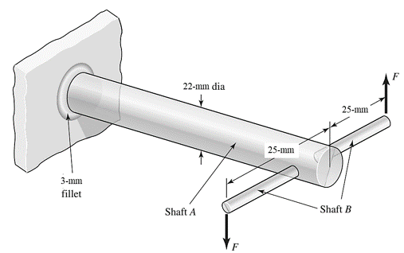

- In the figure shown, shaft A, made of AISI 1020 hot-rolled steel, is welded to a fixed support and is subjected to loading by equal and opposite forces F via shaft B. A theoretical stress-concentration factor Kts of 1.6 is induced in the shaft by the 3-mm weld fillet. The length of shaft A from the fixed support to the connection at shaft B is 0.6 m. The load F cycles from 667 to 2224 N.
  (a) For shaft A, find the factor of safety for infinite life using the Goodman fatigue
  failure criterion.
  (b) Repeat part (a) using the Gerber fatigue failure criterion.
- Ans. (a) *n**f* = 2, (b) *n**f* = 2.5
- 
-