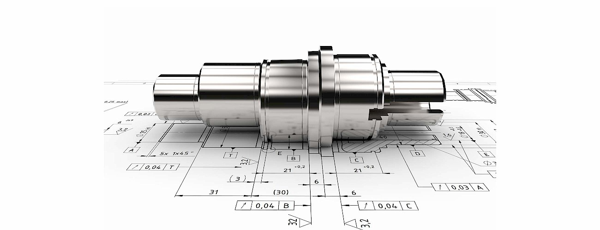

- The course will provide an introduction to concepts, procedures and calculation methods that are necessary to design machine elements that are often included in mechanical units and systems. The course will cover the basics of machine design, including the design process, engineering mechanics and materials, failure prevention under static and variable loading, and characteristics of the principal types of mechanical elements. Also, permanent and non-permanent joints will be studied and analyzed based on what discussed in earlier subjects. Finally, to link fundamental concepts with practical component specification, some significant mechanical components such as shafts and springs will be particularly considered for design and analysis.
- 
-