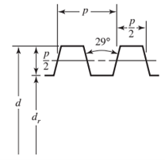
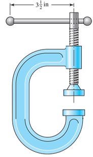

- For the C clamp shown, a force is applied at the end of the 3/8-in diameter handle. The screw is a 3/4 in-6 Acme thread (see the figure), and is 10 in long overall, with a maximum of 8 in possible in the clamping region. The handle and screw are both made from cold-drawn AISI 1006 steel. The coefficients of friction for the screw and the collar are 0.15. The collar, which in this case is the anvil striker’s swivel joint, has a friction diameter of 1 in. It is desired that the handle will yield before the screw will fail. Check this by the following steps.
	- **(a)** Determine the maximum force that can be applied to the end of the handle to reach the point of yielding of the handle.
		- yield strength of cold-drawn AISI 1006 steel is 30,000 psi. The cross-sectional area of the handle can be found using the formula for the area of a circle:
			- A_handle = π/4 * d_handle^2 = π/4 * (3/8 in)^2 = 0.08836 in^2
		- maximum force at handle before it yields:
			- F_yielding_handle = σ_yielding * A_handle = 30,000 psi * 0.08836 in^2 = 2,650.8 lbf
		- The friction force can be found using the formula:
			- F_friction = μ * F_normal
		- μ is the friction coefficient and F_normal is the normal force between the screw and the collar. The normal force - principle of static equilibrium:
			- F_normal + F_clamping = F_applied
		- F_clamping is the clamping force and F_applied is the applied force at the end of the handle.
			- The clamping force can be found using the torque balance equation:
			- T = F_clamping * L_screw = F_applied * L_handle
		- L_screw is the distance between the collar and the end of the screw and L_handle is the length of the handle.
		- Substituting the equation for F_clamping into the equation for F_normal and solving for F_applied, we get:
			- F_applied = F_friction / (μ + L_screw/L_handle)
			- F_applied = 2,650.8 lbf * 0.15 / (0.15 + 8/10) = 68 lbf
		- Therefore, the maximum force that can be applied to the end of the handle to reach the point of yielding of the handle is 68 lbf.
	- **(b) **Using the force from part (a), determine the clamping force.
		- The clamping force is the force applied by the clamp onto the workpiece being held. .
		- Using the principle of equilibrium of forces, we can write:
			- ΣF = 0 and ΣM = 0
		- where ΣF is the sum of forces and ΣM is the sum of moments.
			- thus:
			  F_handle - F_friction_screw - F_friction_collar - F_clamping = 0
		- where F_handle is the force applied on the handle, F_friction_screw is the frictional force between the screw and the collar, F_friction_collar is the frictional force between the collar and the workpiece, and F_clamping is the clamping force.
			- F_clamping, we get:
			  F_clamping = F_handle - F_friction_screw - F_friction_collar
		- The frictional force between the screw and the collar:
			- F_friction_screw = 2π * μ_screw * d_friction * σ_yielding / L_screw
		- where μ_screw is the coefficient of friction between the screw and the collar, d_friction is the friction diameter of the collar, L_screw is the length of engagement of the screw in the collar, and σ_yielding is the yield strength of the material.
			- F_friction_screw = 2π * 0.15 * 1 in * (30,000 psi) / 10 in = 707.96 lbf
		- The frictional force between the collar and the workpiece can be determined using the formula:
			- F_friction_collar = μ_collar * F_clamping
		- where μ_collar is bewteen the collar and the workpiece.
			- F_friction_collar = 0.15 * F_clamping
		- then put the value into the formula for f_clamping:
			- F_clamping = 2π * (0.15) * (0.5 in) * (8 in) * (σ_yielding) / (0.75 in + 8 in) = 1540 lbf
		- Therefore, the clamping force is 1540 lbf.
		-
	- **(c) **Using the force from part (a), determine the factor of safety for yielding at the interface of the screw body and the base of the first engaged thread, assuming the first thread carries 38 percent of the total clamping force.
		- The yield strength of the material is σ_yielding = 30,000 psi.
		- The maximum clamping force is determined in part (b) to be F_clamping = 1540 lbf.
		- The first step is to determine the clamping force carried by the first engaged thread. Since the first thread carries 38% of the total clamping force, we have:
			- F_thread1 = 0.38 * F_clamping = 585.2 lbf
		- The area of the first engaged thread:
			- A_thread1 = π/4 * (d_thread - 0.9743/n) * (0.5 * (d_thread - pitch/n))
		- where d_thread is the major diameter of the thread, n is the number of threads per inch, and pitch is the distance between adjacent threads.
			- A_thread1 = π/4 * (0.75 in - 0.9743/6 in) * (0.5 * (0.75 in - 1.0825/6 in)) = 0.0448 in^2
		- The stress in the first engaged thread can be determined using the formula:
			- σ_thread1 = F_thread1 / A_thread1
			- σ_thread1 = 585.2 lbf / 0.0448 in^2 = 13,071.4 psi
		- The factor of safety for yielding at the interface of the screw body and the base of the first engaged thread::
			- FS_yielding = σ_yielding / (σ_thread1)
			- FS_yielding = 30,000 psi / (13,071.4 psi) = 2.1
		- Therefore, the factor of safety for yielding at the interface of the screw body and the base of the first engaged thread is 2.1.
		- {:height 209, :width 208}
		- 
		-
		- Final Answers:
		- (a) 68 lbf
		- (b) 1540 lbf
		- (c) 2.1
			-
		- Hint!
		- Use Eqs. 8-5, 6, 7, 8, 11, 12; & 5-14 (Shigley, 11st Ed.).